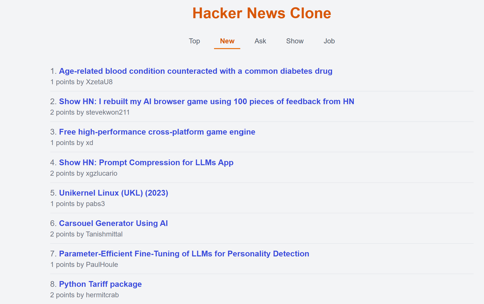

# HackerNews Clone



This repository contains two projects:
- Frontend: Built with NextJS
- Backend: Built with Golang

## Getting Started

Follow these instructions to set up the project on your local machine.

### Prerequisites

* Git
* Node.js and npm
* Go 1.21 or later
* Make
* A Hacker News API.

## Installation

### 1. Clone the Repository

```bash
git clone https://github.com/irfani92/hackernews-clone-backend
cd hackernews-clone-backend
```

### 2. Frontend Setup

Navigate to the frontend directory and install dependencies:

```bash
cd frontend
npm i
```

### 3. Backend Setup

Navigate to the backend directory and install dependencies:

```bash
cd backend
go mod download
```


## Running the Application

### 1. Start the Backend Server

From the project root directory:

```bash
cd backend
go build -o api cmd/api/main.go
./api
```

The API will be available at `http://localhost:8080`.

### 2. Start the Frontend Development Server

Open a new terminal and navigate to the frontend directory:

```bash
cd frontend
npm run dev
```

The frontend will be available at `http://localhost:3000`.

## Tech Stack

### Frontend
- **Framework**: Next.js (React)
- **Styling**: Tailwind CSS

### Backend
- **Framework**: Gin

## Features

- **Backend**
    * Retrieves top stories, new stories, ask stories, show stories, and job stories.
    * Retrieves individual item details (stories, comments, etc.).
    * Uses Hacker News API.
    * Uses Gin framework.
    * CORS enabled.
    * Uses Go Modules

- **Frontend**
    * Displays top stories, new stories, ask stories, show stories, and job stories.
    * Displays individual item details.
    * React.
    * Uses React Router.
    * CORS enabled.
